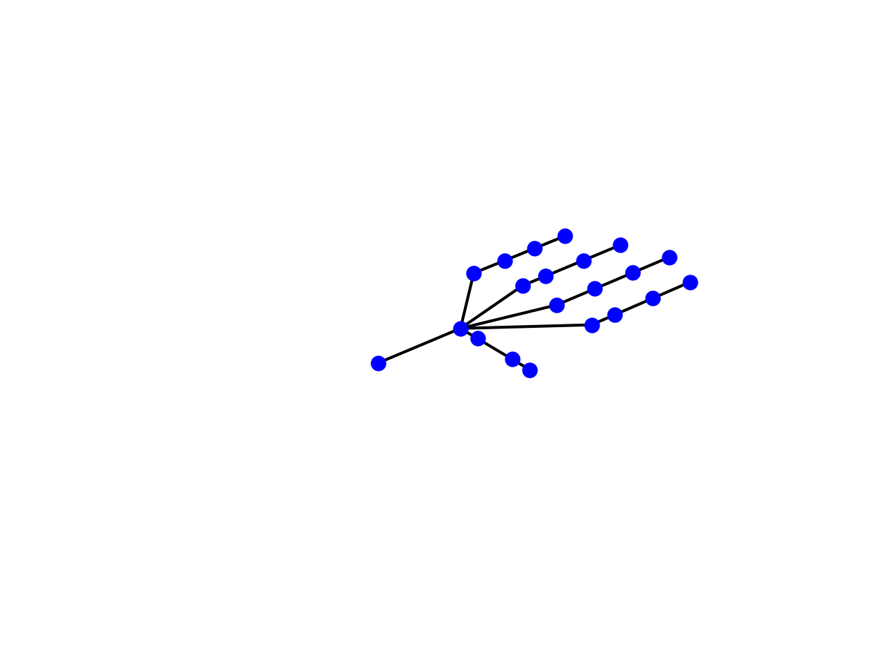
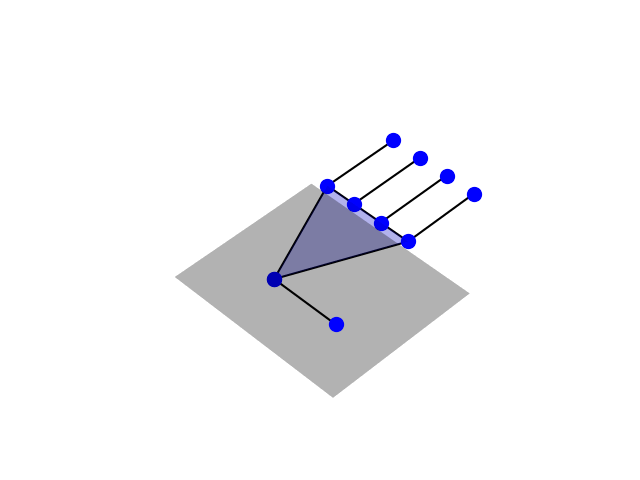

# Simple Hand

I wanted a simple 3D hand model to visualize hand movements in python without the need for external models or software, so I built this.
It simply plots a wireframe hand in matplotlib and allows you to set the flexion of each finger.


SimpleHand:



SuperSimpleHand:




#### Plot a hand:
```python
import matplotlib.pyplot as plt
from simplehand import SimpleHand

hand = SimpleHand()
hand.set_flex(th=0, idx=0, mid=0.5, ri=0.4, pi=0.3)
hand.draw()

plt.show()
```


#### Installation:

```
git clone https://github.com/jtcostello/simple-mpl-hand.git
cd simple-mpl-hand
pip install .
```

